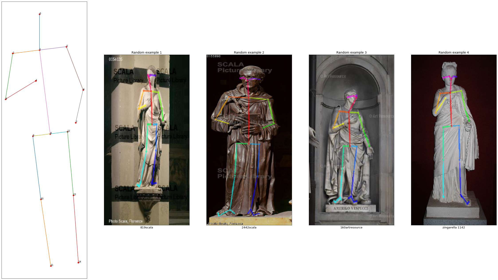
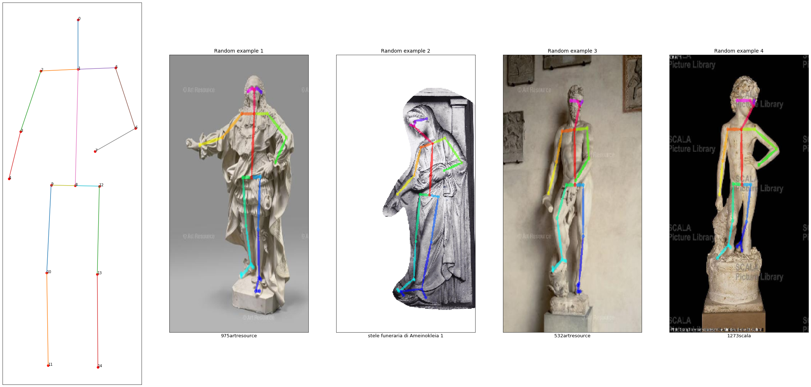

# Pose-ID-on
[<div align="center"></div>]: <>
Pose-ID-on is a free and open source pipeline for **pose clustering of human statues**, to gather similar statues based on their poses. It is authored by [Valerio Marsocci](https://github.com/VMarsocci) and [Lorenzo Lastilla](https://github.com/L9L4). The pose-tracking stage of the process is based on [OpenPose](https://github.com/CMU-Perceptual-Computing-Lab/openpose).

<div align="center"></div>

-----------------

## Contents
1. [Features](#features)
2. [Installation](#installation)
4. [Usage](#usage)
5. [Output](#output)
6. [To Do](#to-do)

## Features

This pipeline, given respectively a set of images of statues and of keyponts, gathers two products:
- **pose comparison**, carried out in two different ways: the first method is slower than the second, but both lead to very satisfying results;
- **pose clustering**, based on K-Means algorithm in a non-euclidean space. 

#### Pose comparison example
<div align="center"></div>

#### Pose clustering example
Following you can find an example of two clusters, from a nine cluster clustering.
<div align="center"></div>
<div align="center"></div>


## Installation

- Download [Python 3](https://www.python.org/)
- Install the packages:
```bash
pip install -r requirements.txt
```


## Usage

After cloning the repo, the user will find three notebooks:
- *OpenPose_install_Colab.ipynb*: in this notebook, a pipeline to clone the [OpenPose](https://github.com/CMU-Perceptual-Computing-Lab/openpose) repo, through [Google Colab](https://colab.research.google.com/notebooks/intro.ipynb), and to obtain the pose-tracking of the statues, is implemented. This procedure provides a set of rendered images and a set of keypoints. Of course, the images and the coordinates of the keypoints can be provided to the following notebook from any source. Whether the rendered images and keypoints are produced by [OpenPose](https://github.com/CMU-Perceptual-Computing-Lab/openpose) or not, images must be in *.png* format, keypoints in *.json* format. Images must be placed in an *./image/* folder in the root directory, keypoints in a *./keypoints/* folder in the root directory. In conclusion, for a given pose called *pose_example*, two files must be provided to the following notebook:
    - a rendered image *./image/pose_example_rendered.png*
    - a set of keypoints *./keypoints/pose_example_keypoints.json*
- *Matching_and_clustering.ipynb*: in this notebook, just following the instructions accurately provided, the pose comparison and the pose clustering can be gathered. The function that loads the keypoints is optimized for the OpenPose data structure: each set of keypoints is stored in a *.json*, with several subsections. We are interested in ```data['people'][0]['pose_keypoints_2d']```, that indicates the 2D coordinates of the keypoints of the foreground statue. So, if you don't use the OpenPose pipeline, be sure that the data are in this form. Each part of the notebook is accurately explained and optimized.
- *Noise_and_errors.ipynb*, divided into two sections. In the first part, some noise is added to the poses, and some graphs are provided, in order to understand the effect of noise on the comparison. In the second section, the error in the pose reconstruction of the centroids of the clustering is computed.

## Output

The user can gather two types of output:
- directly shown in the notebook;
- saved locally:
  - *.txt* files with the most and least similar poses (with respect to a given one) based on the two comparison methods (we suggest to save these files, that could be successively loaded, without the need of computing them several times). The name of these files can be easily choosen by the user, directly in the notebook;
  - *./Cluster/* directory, created when the clustering algorithm is launched. In this directory, *n* images of reconstructed poses from centroids are saved (with *n* number of clusters), together with a *.txt* file with *n* lists, each containing the name of the images belonging to the *i-th* cluster.

## To Do

- Insert in the *ReadMe.md*, the *Citation* and the *License* sections when the article will be published.
