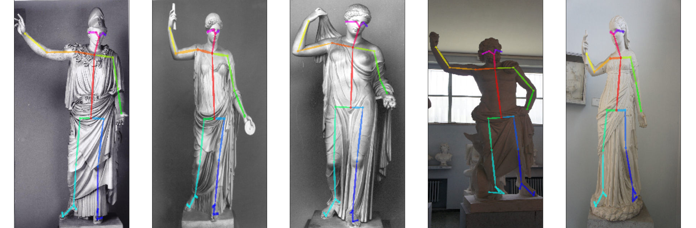

# Pose-ID-on
[<div align="center"></div>]: <>
Pose-ID-on is a free and open source pipeline for **pose clustering of human statues**, to gather similar statues based on their poses. It is authored by [Valerio Marsocci](https://github.com/VMarsocci) and [Lorenzo Lastilla](https://github.com/L9L4). The pose-tracking stage of the process is based on [OpenPose](https://github.com/CMU-Perceptual-Computing-Lab/openpose).

<div align="center"></div>

-----------------

## Contents
1. [Features](#features)
2. [Installation](#installation)
4. [Usage](#usage)
5. [Output](#output)
6. [To Do](#to-do)

## Features

This pipeline, given respectively a set of images of statues and of keyponts, gathers two products:
- **pose comparison**, the first method is slower than the second, due to the fact that they are based on different angle comparison, but both lead to very satisfying results.;
- **pose clustering**, based on K-Means algorithm in a non-euclidean space. Many clustering could be tried and interpreted.


## Installation

- Download [Python 3](https://www.python.org/)
- Install the packages:
```bash
pip install -r requirements.txt
```


## Usage

After cloning the repo, the user will find three notebooks:
- *OpenPose_install_Colab.ipynb*, in this notebook a pipeline to clone the [OpenPose](https://github.com/CMU-Perceptual-Computing-Lab/openpose) repo, through [Google Colab](https://colab.research.google.com/notebooks/intro.ipynb), and obtaining the pose-tracking of the statues, is implemented. This procedure provides a set of rendered images and a set of keypoints. Of course, the images and the coordinates of the keypoints could be provided to the following notebook from any source;
- *Matching_and_clustering.ipynb*, in this notebook, just following the instruction accurately provided the pose comparison and the pose clustering could be gathered. The function that loads the keypoints is optimized for the OpenPose data structure: each set of keypoints is stored in a *.json*, with several subsection. We are interested in ```data['people'][0]['pose_keypoints_2d']```, that indicates the 2D coordinates of the keypoints of the foreground statue. So, if you don't use the OpenPose pipeline, be sure that the data are in this form.
In the following parts of the notebook, all the section are accurately explained and optimized.
- *Noise_and_errors.ipynb*, in this section some aspects. In the first part, some noise is added to the poses, and some graphs are provided, in order to understand how much it affects the comparison. In the second half, the error in the pose reconstruction of the centroids of the clustering is computed.

## Output

The user can obtain several outputs in different forms. Each of them is explained in the notebooks. Anyway, some results are directly shown in the notebook, other are created as images and txt file in directories within the cloned repo.

## To Do

- Insert in the *ReadMe.md*, the *Citation* and the *License* sections when the article will be published.
